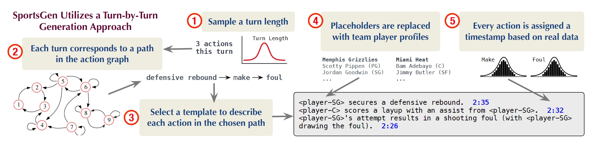
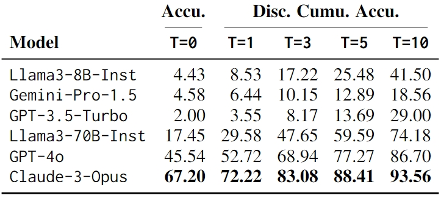
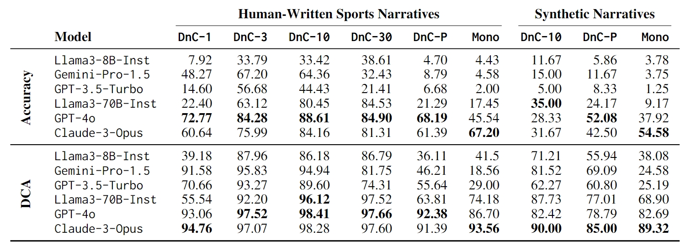

---
Dataset and scripts for sports analyzing tasks proposed in research: \
**When Reasoning Meets Information Aggregation: A Case Study with Sports Narratives**  \
[Yebowen Hu](https://scholar.google.com/citations?user=AHHMtKAAAAAJ&hl=en), Kaiqiang Song, Sangwoo Cho, Xiaoyang Wang, Wenlin Yao, Hassan Foroosh, Dong Yu, Fei Liu  \
[*Accepted to main conference of EMNLP 2024, Miami, Florida, USA*](https://2024.emnlp.org/program/accepted_main_conference/)  \
[Arxiv Paper](https://arxiv.org/abs/2406.12084)

### Abstract
Reasoning is most powerful when an LLM accurately aggregates relevant information. We examine the critical role of information aggregation in reasoning by requiring the LLM to **analyze sports narratives**. To succeed at this task, an LLM must infer points from actions, identify related entities, attribute points accurately to players and teams, and compile key statistics to draw conclusions. We conduct comprehensive experiments with real NBA basketball data and present **SportsGen**, a new method to synthesize game narratives. By synthesizing data, we can rigorously evaluate LLMs' reasoning capabilities under complex scenarios with varying narrative lengths and density of information. Our findings show that most models, including GPT-4o, often fail to accurately aggregate basketball scores due to frequent scoring patterns. Open-source models like Llama-3 further suffer from significant score hallucinations. Finally, the effectiveness of reasoning is influenced by narrative complexity, information density, and domain-specific terms, highlighting the challenges in analytical reasoning tasks.

### Sports Narratives Generation

We introduce a novel method that synthesizes sports narratives by modeling game dynamics.

<div style="text-align: center;">
  
</div>


## Hands-on Sports Analytical Tasks
Tasks published on paper are prepared in the folder "benchmarks/.". Our proposed tasks are also available on Huggingface. https://huggingface.co/datasets/huuuyeah/SportsGen 
```python
from datasets import load_dataset

real_narratives_step_10 = load_dataset("huuuyeah/SportsGen", "real", split="DnC10")
sportsgen_ratio_13 = load_dataset("huuuyeah/SportsGen", "sportsgen", split="ratio_13")
```

Data format
```json
{
    "instance_id": "game_11_1_1",
    "system_msg": "You are a helpful assistant tasked with analyzing sports games...",
    "prompt_msg": "Analyze the team-player affiliations and play-by-play descriptions...",
    "truth": {"team1": 22, "team2": 19}
}
```

## Generate your own dataset
SportsGen requires a small amount of LLM calling tokens. Prepare your API key in "config/openai_key.yaml" before you start data synthesis. 

### Step 1: Synthesizing New Games
```bash
# Simply run bash for a toy example
bash generate_new_game.sh

# or customize through command
python simulation.py \
        -bench_name new_games \
        -bench_size 10 \
        -strong_team_strength 90 \ 
        -weak_team_strength 70 \
        -ratio "1:5" \
        -anonymous False
    
 # @bench_size: int, number of instances you want in your test set
 # @strong_team_strength: int, the lowest player score in a winner team 
 # @weak_team_strength: int, the highest player score in a loser team
 # @ratio: str or float, set to "1:2", "1:3", "1:4", "1:5" as paper presented
 # @anonymous: bool, To mask the real player name, substitute it with player_id.
```

You will find your simulated games in "simulations/{bench_name}/game_{id}.json".

### Step 2: Creating Benchmarks for Sports Narratives Reasoning
At this step, you can generate multiple reasoning benchmark tasks based on the games created in the previous steps.
```bash
# Simply run bash for a toy example
bash create_benchmark.sh

# or customize through command
python benchmark.py \
    -game_folder  simulations/new_games_10_1:5 \
    -bench_name  new_games \
    -steps False \
    -player_stats False

# @steps: int or false, create benchmark task separated in steps.
# @player_stats: bool, True for player stats prediction, dafult to False for team scores prediction
```

The generated task will be saved in "benchmarks/."

## Evaluate Results

We proposed Discounted Cumulative Accuracy(DCA) which allows a small margin of error when LLMs perform on number prediction.
<p align="center">
$DCA = \sum_{t=0}^{T} p_t(1-\frac{t}{T})$ <br>
$p_t = \frac{1}{N}\sum_{n=1}^N {1}_{\{\lvert s_n - s_n^* \rvert = t\}}$
</p>
Once you have your model predictions and target labels prepared in two separate lists, you can use the metric function implemented in utils by input the two lists and set a tolerance level.

```python
from utils.metric import DCA

accuracy = DCA(predictions, labels, T=5)
```

We experimented with varying tolerance levels to assess the impact of this parameter.

<p align="center">

</p>

## Experimental Results

<p align="center">

</p>

---
**Bibtex**
```
@misc{hu2024reasoningmeetsinformationaggregation,
      title={When Reasoning Meets Information Aggregation: A Case Study with Sports Narratives}, 
      author={Yebowen Hu and Kaiqiang Song and Sangwoo Cho and Xiaoyang Wang and Wenlin Yao and Hassan Foroosh and Dong Yu and Fei Liu},
      year={2024},
      eprint={2406.12084},
      archivePrefix={arXiv},
      primaryClass={cs.CL},
      url={https://arxiv.org/abs/2406.12084}, 
}
```
